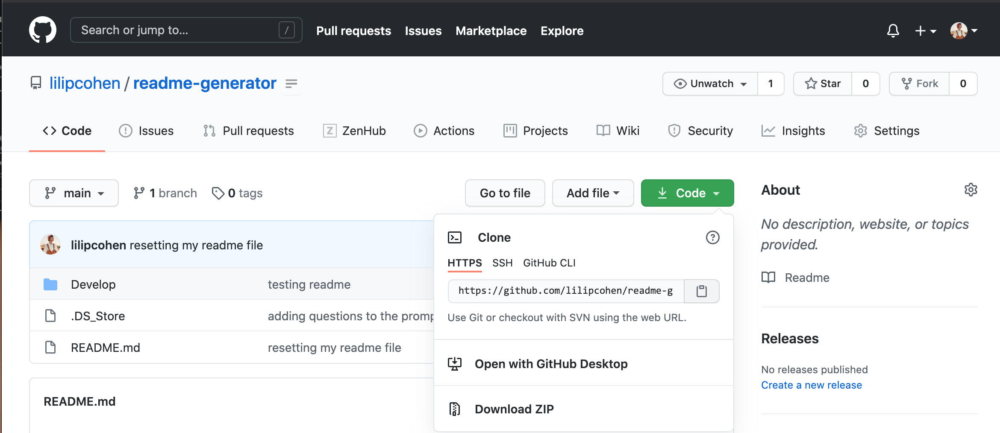
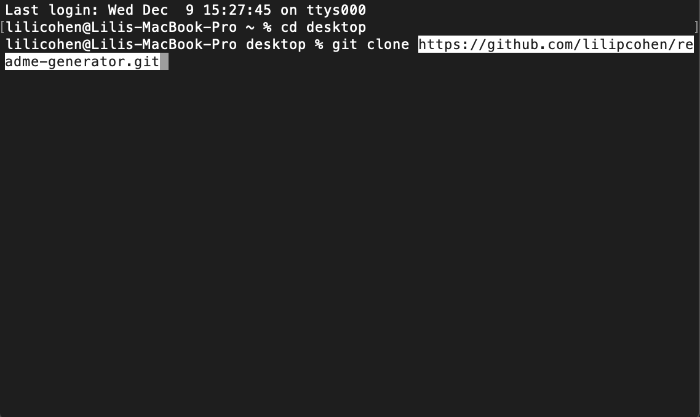
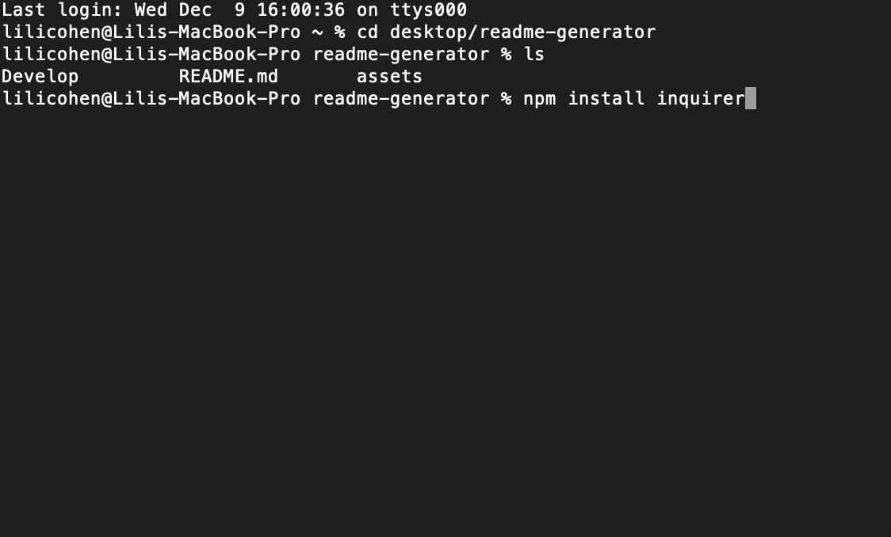

# readme-generator

## Overview

This project, I was to use node and the inquirer package to dynamically generate a readme file for a user. The user is to use comman line or terminal after cloning the repo, installing the inquirer package with "npm install inquirer", and enter "node inedx.js". This will prompt users to answer a series of questions that correlate to generating their own personal readme.md file with their inputs.

### photos

Copy https

using terminal git clone "pasted repo https"

install inquirer package to utilize the generator

[Link](https://lilipcohen.github.io/weather-dashboard/)

## Readme Example
